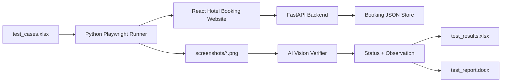

# Overall Approach Diagram

```mermaid
flowchart LR
  A["test_cases.xlsx"] --> B["Python Playwright Runner"]
  B --> C["React Hotel Booking Website"]
  C --> D["FastAPI Backend"]
  D --> E["Booking JSON Store"]
  B --> F["screenshots/*.png"]
  F --> G["AI Vision Verifier"]
  G --> H["Status + Observation"]
  H --> I["test_results.xlsx"]
  H --> J["test_report.docx"]
```
